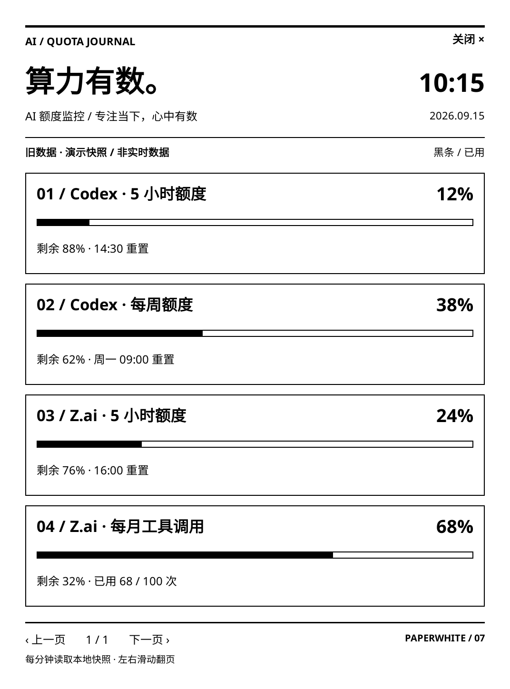

# 算力有数 · Kindle AI 额度面板

把闲置的 **Kindle Paperwhite 第七代（Paperwhite 3 / KPW3）**，改成放在桌边的 AI 额度看板。

这个版本围绕我自己的 KPW3 做了魔改：保留电脑采集额度、GitHub Pages 中转的流程，把 Kindle 端的主要入口改成 **KOReader 原生全屏插件**，用黑白大字、用量条和分页展示 Codex、Z.ai 等服务的额度。

## 为什么魔改？

原来的项目是一个网页版中控台：时间、天气、每日一语和多家 AI 服务放在同一页。这个方向适合查看综合信息，但我更想解决一个具体问题：**写代码时，抬头就能知道 AI 还剩多少额度、什么时候重置。**

我的设备是 Kindle Paperwhite 第七代。围绕这台老设备，改动集中在三件事：

- **把额度放在最显眼的位置。** 默认展示 Codex 和 Z.ai，突出已用比例、剩余额度、重置时间，减少无关信息。
- **让布局适合墨水屏。** 以 1072 × 1448 竖屏为目标，用白底黑字、清晰边框和固定留白；内容多了翻页，不把所有信息挤在一屏。
- **让更新成为日常可用的流程。** 电脑运行一个 npm 命令持续采集并上传，Kindle 联网后定时拉取，日常更新无需反复插 USB。

## 魔改成了什么样？

| 项目 | 原来的设计 | 当前魔改版 |
| --- | --- | --- |
| Kindle 展示入口 | 网页中控台 | KOReader 原生插件，保留网页预览 |
| 信息重点 | 时间、天气、每日一语、多平台卡片 | 额度窗口、已用比例、剩余量、重置时间 |
| 默认数据源 | Claude、Codex、Kimi、DeepSeek | Codex、Z.ai，可通过配置调整 |
| 排版 | 综合信息与多列卡片 | 黑白竖屏列表，每页最多 4 项额度窗口 |
| 操作 | 网页交互 | 左右滑动或底部按钮翻页，右上角关闭 |
| 电脑端更新 | 分步采集、构建、发布 | `npm run watch` 持续执行完整刷新上传流程 |
| Kindle 数据更新 | 网页拉取数据 | 插件读取本地快照，并定时从云端同步 |

### 当前面板样图

<p align="center">
  
</p>

**这是 KOReader Linux 版在 Docker 中运行插件得到的 1072 × 1448 截图，使用演示数据，不是真机照片。** 图中的“旧数据 / 演示快照”用于说明数据状态，百分比也不是实时账户额度。真机的墨水屏残影、刷新速度和耗电需要单独验证。

### 魔改前的网页样图

<details>
<summary>展开查看原来的综合中控台布局</summary>

<p align="center">
  
</p>

这是仓库保留的旧版网页演示截图，便于对比信息布局。

</details>

## 我的设备与当前状态

| 项目 | 说明 |
| --- | --- |
| 设备 | **Kindle Paperwhite 第七代（KPW3）** |
| 面板目标尺寸 | 1072 × 1448，竖屏 |
| Kindle 端 | 已越狱，安装 KUAL、KOReader，再安装额度插件 |
| 电脑端 | 当前使用 Windows；完整图片生成脚本会查找 Windows 上的 Chrome / Edge |
| 数据中转 | GitHub Pages，插件另配有 jsDelivr 备用地址 |

当前已确认这台设备能打开 KOReader；插件已有模拟器预览。KUAL →「AI 额度面板」快捷入口曾停留在启动提示，原因仍待排查，因此下面以 **先打开 KOReader，再从插件菜单打开面板** 为使用路径。

## 数据怎么到 Kindle？

```text
电脑上的账户凭证 / 环境变量
            │
            ▼
       采集 AI 额度
            │
            ▼
导出数据 + 生成网页与面板 PNG
            │
            ▼
       GitHub Pages
            │  Kindle 通过 Wi-Fi 拉取 kindle.json
            ▼
   本地 aiquota/data.json
            │
            ▼
     KOReader 原生面板
```

电脑和 Kindle 不需要在同一个 Wi-Fi，只要各自能访问所需的网络服务即可。原生插件使用 JSON 数据绘制界面；发布的 PNG 是额外产物。

这是**定时更新**：电脑采集上传、Pages 发布、Kindle 拉取之间会有延迟。

## 开始使用

### 1. 准备电脑端配置

准备 Node.js 18+、Git，以及用于生成图片的 Chrome 或 Edge。Git 必须能向自己的 GitHub 仓库推送；如需脚本自动配置 Pages，还需已登录的 `gh` CLI，否则在仓库 Settings → Pages 中手动选择 `gh-pages` 分支。

将 `config.example.json` 复制为 `config.json`，按需启用数据源。模板默认关闭全部采集器，`displayProviders` 控制展示的服务与顺序：

```json
"displayProviders": ["codex", "zai"]
```

- Codex：将 `providers.codex.enabled` 设为 `true`，准备好本机已登录的 Codex CLI；需要指定路径时设置 `CODEX_CLI_PATH` 环境变量。
- Z.ai：将 `providers.zai.enabled` 设为 `true`，在运行命令的环境中设置 `ZAI_API_KEY`。
- 其他采集器配置见 [配置模板](config.example.json) 和 [系统架构](docs/architecture.md)。

密钥和登录凭证留在电脑端，不要填进公开文件。Pages 上的额度快照可被访问，公开内容可能包含百分比、余额、时间和说明，详见 [隐私说明](docs/privacy.md)。

### 2. 先刷新上传一次

在项目根目录运行：

```bash
npm run refresh
```

按顺序执行：**采集 → 导出 Kindle 数据 → 生成图片 → 构建并上传 GitHub Pages**。发布到 `origin` 对应仓库的 `gh-pages` 分支；该分支用于生成站点，每次发布会重建并强推，不要在里面保存手写源码。

主要产物包括：

| 文件 | 用途 |
| --- | --- |
| `data.json` / `data.js` | 网页额度数据 |
| `kindle.json` | KOReader 插件同步数据 |
| `dashboard.png` / `dashboard-gray.png` | 电脑渲染的面板图片 |

### 3. 安装 Kindle 插件

通过 USB 连接 Kindle，复制以下文件：

```text
Kindle USB 盘根目录/
├─ koreader/
│  └─ plugins/
│     └─ aiquota.koplugin/   ← 复制 kindle/koplugin/aiquota.koplugin 整个目录
└─ aiquota/
   └─ data.json             ← 复制 state/kindle.json，并改名
```

只想先看样式，可以用 `examples/kindle.example.json` 作为 `data.json`，其中是演示数据。

**使用自己的仓库时，必须修改插件的数据地址。** 在 [main.lua](kindle/koplugin/aiquota.koplugin/main.lua) 顶部的 `DATA_URLS` 中，把 Pages 和两个 CDN 地址改成自己的用户名、仓库名；当前默认地址指向本项目维护者的站点。完成修改后再复制插件到 Kindle。

安全弹出 USB，重启 KOReader，进入：

**屏幕顶部菜单 → 工具 → AI 额度 → 打开面板**

面板不是一本书，不需要在 KOReader 文件浏览器里打开某个文件夹。菜单中还可以勾选「KOReader 启动时自动打开面板」。

详细安装和预览说明见 [KOReader 插件文档](docs/koreader-plugin.md)。

### 4. 持续刷新上传

日常使用只需让电脑保持运行：

```bash
npm run watch
```

启动后立即刷新上传一次，每轮结束后等待 **3 分钟**再执行。失败时输出日志，下轮重试，各轮不会重叠。终端需保持打开，按 `Ctrl+C` 停止；这不会安装系统服务，也不会设置开机自启。

其他用法：

```bash
npm run refresh:watch       # 每轮结束后等待 10 分钟
npm run refresh:watch -- 5  # 自定义为 5 分钟
```

Kindle 插件打开时会先显示本地快照，再尝试云端同步；面板打开期间约每 **5 分钟**拉取一次，每分钟重新读取本地数据并更新时钟。联网失败时可继续显示已有快照，超过 **15 分钟**会标记为旧数据。休眠和唤醒沿用 KOReader 行为。

## 不连接 Kindle，也能预览

### 网页演示

```bash
npm run demo
npm run build
npm run serve
```

打开 `http://127.0.0.1:8787`。演示不会读取真实账户，但会覆盖 `state/` 中当前的额度快照；恢复真实数据时重新运行 `npm run refresh`。

### 原生插件预览

准备 Docker 和 KOReader Linux x86_64 AppImage，放到 `docker/koreader-sim/koreader.AppImage`，然后运行：

```bash
npm run preview:koreader -- --build
npm run preview:koreader -- --test
```

截图输出到 `state/koreader-preview/`，默认使用演示数据。准备步骤见 [Docker 预览说明](docs/koreader-plugin.md#docker-预览windows--macos--linux)。

## 常用修改位置

| 想改什么 | 文件 |
| --- | --- |
| 启用的数据源、展示顺序 | `config.json` |
| Kindle 面板布局、字体、同步地址 | `kindle/koplugin/aiquota.koplugin/main.lua` |
| 持续刷新逻辑 | `scripts/refresh-watch.cjs` |
| 额度导出格式 | `scripts/export-kindle.cjs` |
| 网页外观 | `web/index.html`、`web/style.css` |
| 网页数据读取与渲染 | `web/dashboard-runtime.js` |

## 文档与致谢

本版本基于 Kindle AI Quota Dashboard 项目继续修改，保留电脑采集和静态站点发布思路，围绕自己的 KPW3 增加原生插件、额度排版和持续更新流程。感谢原项目与 KOReader 的贡献者。

- [KOReader 插件安装与使用](docs/koreader-plugin.md)
- [系统架构](docs/architecture.md)
- [隐私说明](docs/privacy.md)
- [故障排查](docs/troubleshooting.md)
- [参与贡献](CONTRIBUTING.md)

## 想继续魔改怎么办
让 ai agent 帮忙

## 许可证

[MIT License](LICENSE)
